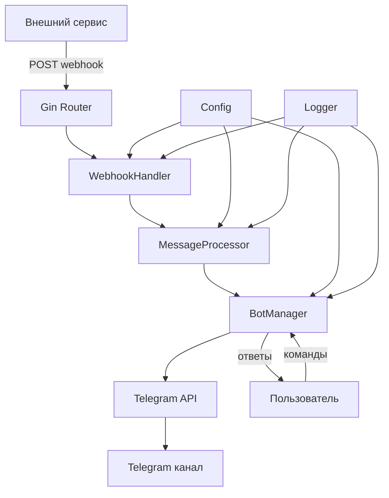

# Системные паттерны: Chateau Bot

## Архитектурные паттерны

### 1. Модульная архитектура (Go-стиль)
- **Разделение на пакеты**: internal/ для внутренней логики, pkg/ для переиспользуемого кода
- **Слабая связанность**: Интерфейсы для взаимодействия между модулями
- **Высокая сплоченность**: Код в пакете решает связанные задачи

### 2. Конкурентное программирование
- **Goroutines**: Легковесные потоки для параллельной обработки
- **Channels**: Безопасная передача данных между goroutines
- **Select statements**: Неблокирующие операции с каналами

### 3. Конфигурация через Viper
- **Структурированная конфигурация**: Использование struct с тегами
- **Иерархия источников**: env vars → config file → defaults
- **Валидация**: Проверка обязательных параметров при старте

## Ключевые компоненты

### Bot Manager
```go
type BotManager struct {
    bot *tgbotapi.BotAPI
    config *config.Config
    logger logger.Logger
}

// Управляет Telegram ботом и его состоянием
func (bm *BotManager) Start(ctx context.Context) error
func (bm *BotManager) SendToChannel(channelID string, message string) error
func (bm *BotManager) GetWebhookURL() string
func (bm *BotManager) HandleCommands(update tgbotapi.Update)
```

### Webhook Handler
```go
type WebhookHandler struct {
    botManager *BotManager
    logger logger.Logger
}

// Обрабатывает входящие вебхуки
func (wh *WebhookHandler) HandleWebhook(c *gin.Context)
func (wh *WebhookHandler) ValidateRequest(data []byte) error
func (wh *WebhookHandler) ProcessData(data WebhookData) error
```

### Message Processor
```go
type MessageProcessor struct {
    retryClient *retryablehttp.Client
    logger logger.Logger
}

// Форматирует и отправляет сообщения
func (mp *MessageProcessor) FormatMessage(data interface{}) string
func (mp *MessageProcessor) SendWithRetry(channelID, message string) error
```

### Configuration Manager
```go
type Config struct {
    TelegramToken string `mapstructure:"telegram_token" validate:"required"`
    WebhookPort   int    `mapstructure:"webhook_port" default:"8080"`
    LogLevel      string `mapstructure:"log_level" default:"info"`
    Channels      []ChannelConfig `mapstructure:"channels"`
}

type ChannelConfig struct {
    ID   string `mapstructure:"id" validate:"required"`
    Name string `mapstructure:"name"`
    Type string `mapstructure:"type" default:"general"`
}
```

## Взаимодействие компонентов



## Go-специфичные паттерны

### 1. Context для отмены операций
```go
func (bm *BotManager) Start(ctx context.Context) error {
    for {
        select {
        case <-ctx.Done():
            return ctx.Err()
        case update := <-bm.updates:
            go bm.HandleUpdate(update)
        }
    }
}
```

### 2. Интерфейсы для тестируемости
```go
type BotAPI interface {
    Send(c tgbotapi.Chattable) (tgbotapi.Message, error)
    GetUpdatesChan(config tgbotapi.UpdateConfig) tgbotapi.UpdatesChannel
}

type TelegramBot struct {
    api BotAPI
}
```

### 3. Graceful shutdown
```go
func main() {
    ctx, cancel := context.WithCancel(context.Background())
    
    c := make(chan os.Signal, 1)
    signal.Notify(c, os.Interrupt, syscall.SIGTERM)
    
    go func() {
        <-c
        cancel()
    }()
    
    if err := app.Run(ctx); err != nil {
        log.Fatal(err)
    }
}
```

## Паттерны обработки ошибок

### 1. Wrapped errors
```go
func (bm *BotManager) SendMessage(channelID, text string) error {
    msg := tgbotapi.NewMessage(channelID, text)
    if _, err := bm.bot.Send(msg); err != nil {
        return fmt.Errorf("failed to send message to channel %s: %w", channelID, err)
    }
    return nil
}
```

### 2. Retry с экспоненциальной задержкой
```go
func (mp *MessageProcessor) SendWithRetry(channelID, message string, maxRetries int) error {
    for i := 0; i < maxRetries; i++ {
        if err := mp.sendMessage(channelID, message); err != nil {
            if i == maxRetries-1 {
                return err
            }
            time.Sleep(time.Duration(math.Pow(2, float64(i))) * time.Second)
            continue
        }
        return nil
    }
    return nil
}
```

### 3. Circuit Breaker pattern
```go
type CircuitBreaker struct {
    maxFailures int
    failures    int
    lastFailure time.Time
    timeout     time.Duration
    mutex       sync.RWMutex
}
```

## Логирование и мониторинг

### Структурированные логи с Logrus
```go
logger.WithFields(logrus.Fields{
    "webhook_id": webhookID,
    "channel_id": channelID,
    "duration":   duration.Milliseconds(),
}).Info("webhook processed successfully")
```

### Метрики
- Количество обработанных вебхуков
- Время ответа API
- Ошибки и их типы  
- Использование goroutines 